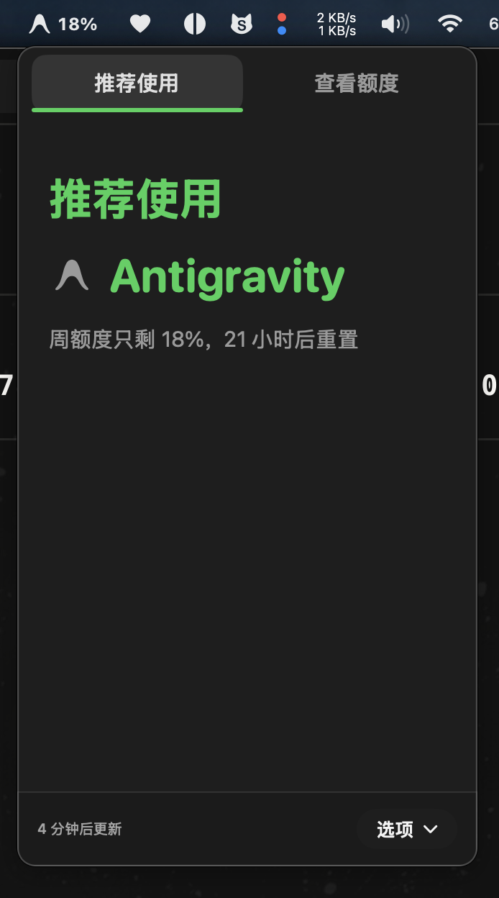
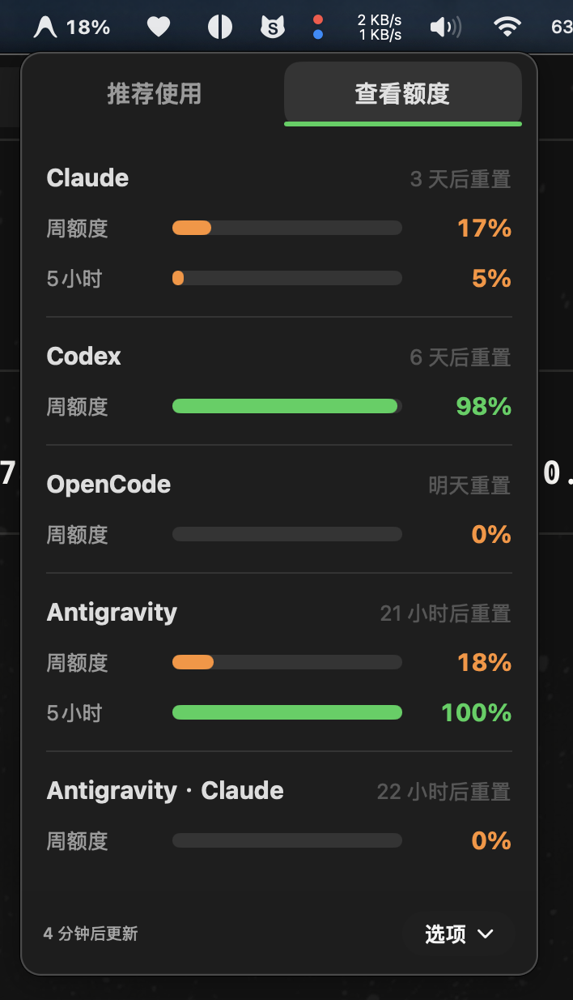

# MaxUsage

<p align="left">
  <a href="README.md">English</a> | <strong>简体中文</strong>
</p>

> *"我订阅了多个 AI 编程工具，现在写代码应该开哪一个，才能最大化利用额度、避免浪费？"*

**MaxUsage** 是一款专为 macOS 设计的轻量级菜单栏应用。它通过智能分层调度算法，根据你各个 AI 编程订阅（Claude、Codex、Antigravity、OpenCode 等）的实时剩余额度与重置倒计时，**精准推荐你当前最应该使用哪一个订阅**，让你花钱买的每一分算力都物尽其用。

同时支持一键总览所有订阅的 5 小时短窗口、周额度进度以及精准重置时间。

---

## 界面截图

<p align="center">
  
  &nbsp;&nbsp;&nbsp;&nbsp;
  
</p>

---

## 为什么需要 MaxUsage？

我同时订阅了 5 个不同的 AI 编程工具。每次开始写代码前，我总要纠结：**“现在该用哪一个，才能在重置前把额度用满，避免浪费？”**

每天手动去查 5 个服务的网页后台非常繁琐耗时：

<p align="center">
  <br/><br/>
  <br/><br/>
  <br/><br/>
  <br/><br/>
  
</p>

**MaxUsage 让这一切只需 1 秒** —— 它在本地自动分析你所有订阅的剩余额度与重置窗口，直接告诉你下一刻最该打开谁。

---

## 安装方式

### Homebrew 一键安装（推荐）

```sh
brew install 1c7/tap/max-usage
```

### 直接下载安装包

前往 [GitHub Releases](https://github.com/1c7/max-usage/releases/latest) 下载最新的 Universal DMG 安装包，打开后将 **MaxUsage** 拖入 `/Applications`（应用程序）文件夹即可。

> **系统要求**：macOS 15 (Sequoia) 或更高版本。原生支持 Apple Silicon (M系列芯片) 与 Intel 架构 Mac。

---

## 文档与开发指引

- **功能与使用文档**：查阅 [完整文档中心](docs/README.md) 了解支持的服务商、快捷键、代理设置、CLI 命令行以及本地 HTTP API。
- **开发者指引**：查阅 [开发与架构指南](docs/development.md) 了解本地编译、运行测试、发布流程与架构设计。

---

## 鸣谢与致谢 (Acknowledgements)

**MaxUsage** 由 [郑诚 (Cheng Zheng)](https://github.com/1c7) 开发与维护。

本项目基于优秀的开源项目 [OpenUsage](https://github.com/robinebers/openusage)（由 [Robin Ebers](https://itsbyrob.in/x)、[Mert](https://github.com/validatedev) 与 [David](https://github.com/davidarny) 原创开发）进行深度定制与重构。非常感谢原作者团队为开源社区做出的卓越贡献！

---

## 开源协议

[MIT](LICENSE)
