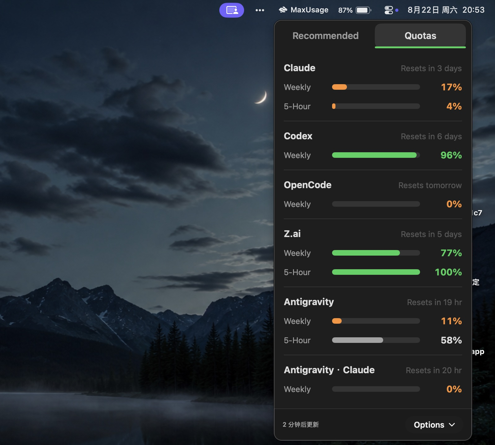
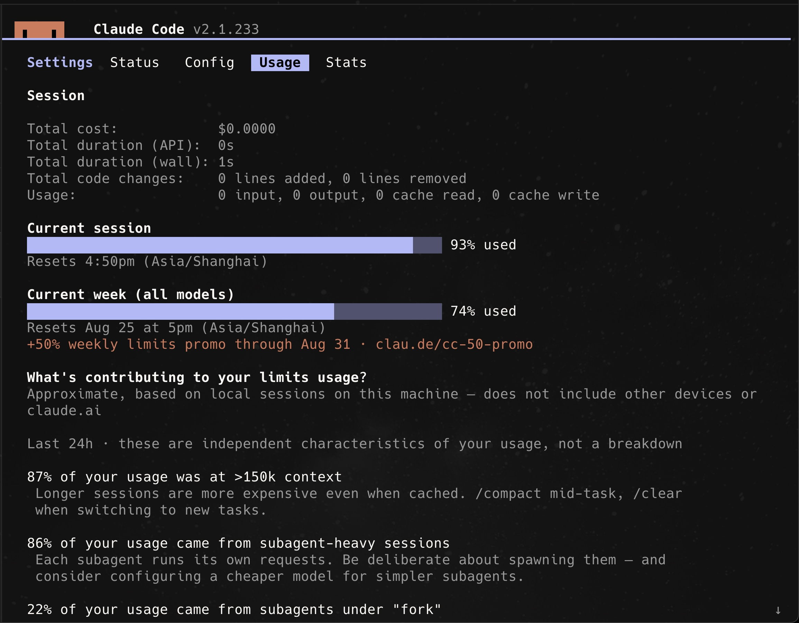
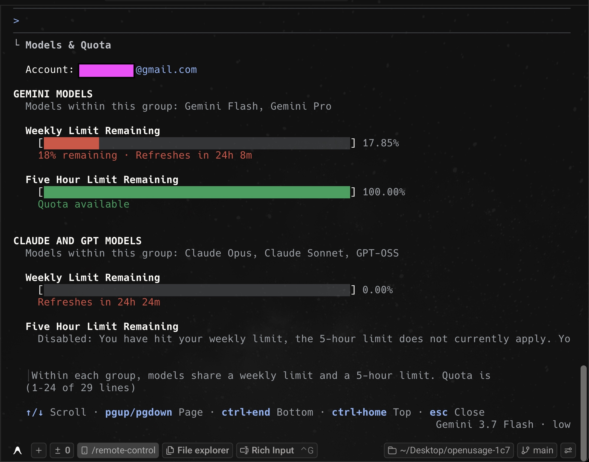

# MaxUsage

<p align="left">
  <strong>English</strong> | <a href="README-zh-CN.md">简体中文</a>
</p>

> *"I have multiple AI coding subscriptions — which one should I use right now to maximize my quota?"*

**MaxUsage** is a lightweight macOS menu-bar app that intelligently recommends which AI coding subscription (Claude, Codex, Antigravity, OpenCode, Cursor, and more) you should use right now, based on your remaining quotas and reset countdowns to prevent quota waste.

It also provides an instant overview of all your subscription limits, 5-hour/weekly quotas, credits, and reset countdowns in a single click.

---

## Screenshots

<p align="center">
  
</p>
<p align="center">
  
</p>

---

## Why MaxUsage?

I subscribe to 5 different AI coding tools. Before writing code, I constantly faced the same dilemma: **Which subscription should I use right now to maximize my quota before it resets?**

Checking 5 separate usage pages every day is tedious:

<p align="center">
  <br/><br/>
  <br/><br/>
  <br/><br/>
  <br/><br/>
  
</p>

**MaxUsage solves this in 1 click** — it analyzes remaining quotas and reset windows across all your plans, and instantly tells you exactly which one to use next.


## Installation

### Homebrew (Recommended)

```sh
brew install 1c7/tap/max-usage
```

### Direct Download

Download the latest universal DMG from the [GitHub Releases](https://github.com/1c7/max-usage/releases/latest) page, open it, and drag **MaxUsage** into your `/Applications` folder.

> **Requirements:** macOS 15 (Sequoia) or later. Runs natively on both Apple Silicon and Intel Macs.

---

## Documentation & Development

- **User & Feature Docs:** See the full [Documentation Index](docs/README.md) for details on supported providers, dashboard shortcuts, proxy configuration, CLI usage, and local HTTP APIs.
- **Developer Guide:** See [Development & Architecture Docs](docs/development.md) for instructions on building from source, running tests, release workflows, and codebase architecture.

---

## Acknowledgements

**MaxUsage** is created and maintained by [Cheng Zheng](https://github.com/1c7).

It is proudly built upon the foundational codebase of the awesome open-source project [OpenUsage](https://github.com/robinebers/openusage), originally created by [Robin Ebers](https://itsbyrob.in/x), [Mert](https://github.com/validatedev), and [David](https://github.com/davidarny). Huge thanks to their fantastic work and contribution to the developer community!

---

## License

[MIT](LICENSE)
