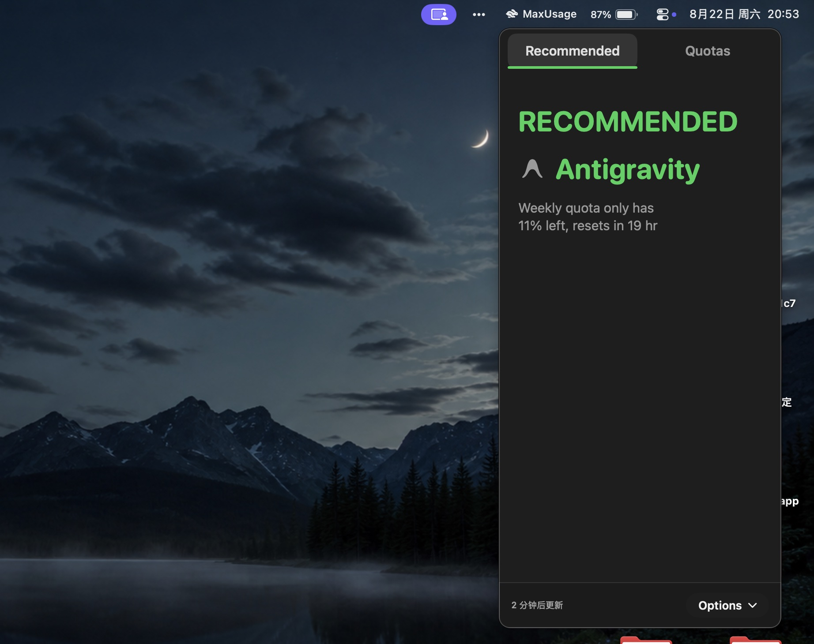

# MaxUsage

<p align="left">
  <strong>English</strong> | <a href="app/docs/README-zh-CN.md">简体中文</a>
</p>

Intelligently recommends which AI coding subscription (Claude, Codex, Antigravity, OpenCode, Cursor, and more) to use right now to maximize your quotas.

<p align="center">
  
</p>
<p align="center">
  
</p>

---

## Why MaxUsage?

I subscribe to 6 different AI coding tools and wanted to maximize usage across all of them. Checking each one's usage page by hand is tedious:

<p align="center">
  <strong>Claude Code</strong><br/>
  <br/><br/>
  <strong>Codex</strong><br/>
  <br/><br/>
  <strong>agy (Antigravity, by Google)</strong><br/>
  <br/><br/>
  <strong>OpenCode</strong><br/>
  <br/><br/>
  <strong>GLM Coding Plan</strong><br/>
  <br/><br/>
  <strong>SuperGrok</strong><br/>
  
</p>

MaxUsage shows all remaining quotas and reset times, and tells you which one to use first.

---

## Download

[Download the latest DMG](https://github.com/1c7/max-usage/releases/latest/download/MaxUsage.dmg), open it, and drag **MaxUsage** into your `/Applications` folder.

### Homebrew

```sh
brew install 1c7/tap/max-usage
```

---

## Acknowledgements

**MaxUsage** is created and maintained by [Cheng Zheng](https://github.com/1c7), built upon [OpenUsage](https://github.com/robinebers/openusage). Licensed under [MIT](LICENSE).
