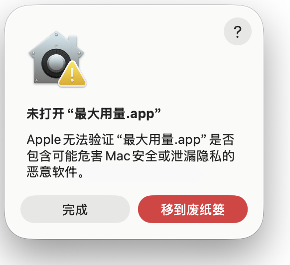
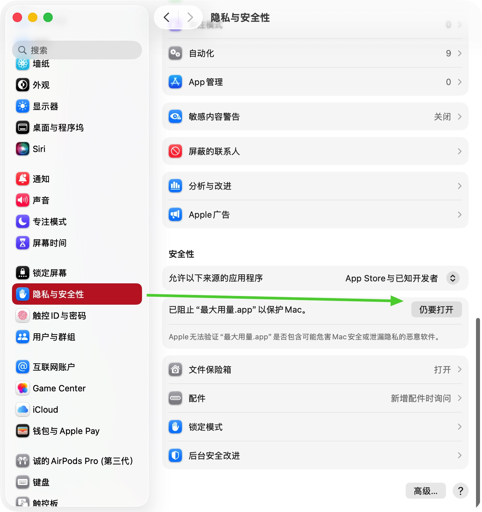

# MaxUsage

<p align="left">
  <a href="../../README.md">English</a> | <strong>简体中文</strong>
</p>

如果你订阅了 2 个以上 AI 套餐，想最大化用量，本软件会根据剩余额度与重置时间，智能推荐应该用哪一个 AI 订阅套餐来最大化用量。

<p align="center">
  
</p>
<p align="center">
  
</p>

---

## 故事背景

我（本软件作者）订阅了 6 个 AI 套餐（如下图）。我想知道如何用量最大化，手动查 6 个用量非常麻烦：

<p align="center">
  <strong>Claude Code</strong><br/>
  <br/><br/>
  <strong>Codex</strong><br/>
  <br/><br/>
  <strong>agy（Antigravity，Google 出品）</strong><br/>
  <br/><br/>
  <strong>OpenCode</strong><br/>
  <br/><br/>
  <strong>GLM Coding Plan</strong><br/>
  <br/><br/>
  <strong>SuperGrok</strong><br/>
  
</p>

MaxUsage 显示所有剩余额度和重置时间，告诉你先用哪一个

---

## 安装方式 1：Homebrew（推荐）

```sh
brew install 1c7/tap/max-usage
```

### 安装方式 2：下载安装包

[前往下载页](https://github.com/1c7/max-usage/releases/latest) 下载 .dmg 安装包，打开后将 **MaxUsage** 拖入 `/Applications`（应用程序）文件夹即可。

## 打不开？"Apple 无法验证" 怎么解决

双击打开 App 时，如果看到下面这个提示，不用担心，这是因为当前的安装包是 ad-hoc 签名、还没经过 Apple 公证（notarization），macOS 默认会拦一下，不是软件本身有问题：

<p align="center">
  
</p>

解决方法：

1. 打开 **系统设置 → 隐私与安全性**
2. 往下滑到"安全性"区域，会看到一条"已阻止「最大用量.app」以保护 Mac"的提示，点击右边的 **仍要打开**

<p align="center">
  
</p>

3. 输入你的 Mac 密码确认
4. 再双击一次 App，会弹出第二次确认框，点 **打开** 即可正常启动

也可以用终端一条命令解决（效果一样，去掉下载文件的"隔离标记"）：

```sh
xattr -cr "/Applications/最大用量.app"
```

## 备注

**MaxUsage** 由 [郑诚 (Cheng Zheng)](https://github.com/1c7) 开发与维护。

本项目基于 [OpenUsage](https://github.com/robinebers/openusage)（由 [Robin Ebers](https://itsbyrob.in/x)、[Mert](https://github.com/validatedev) 与 [David](https://github.com/davidarny) 原创开发）进行深度定制与重构。非常感谢原作者团队。

---

## 开源协议

[MIT](../../LICENSE)
