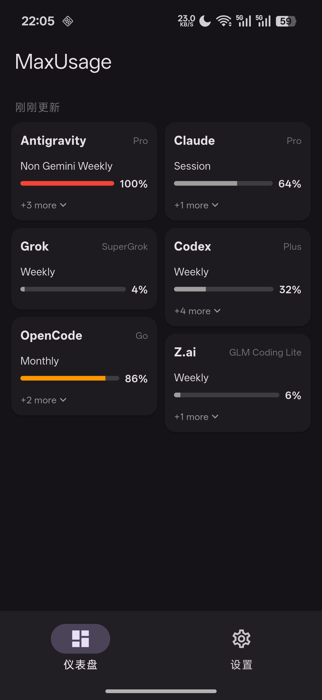
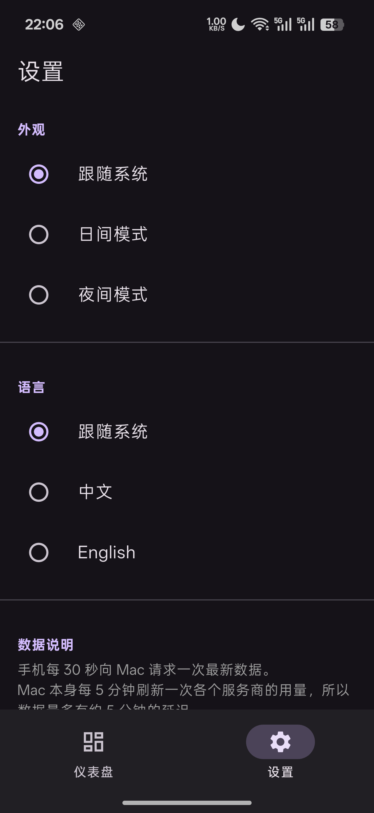

# MaxUsage Mobile App (Android First)

Read-only Android companion for the [MaxUsage](../macos) macOS app. All data comes from a paired
Mac over the local network — no accounts, no provider credentials, nothing to configure beyond
pairing once via QR code. See [`docs/lan-sync.md`](../macos/docs/lan-sync.md) in the macOS app for
the pairing/sync protocol.

## Screenshots

  
  

